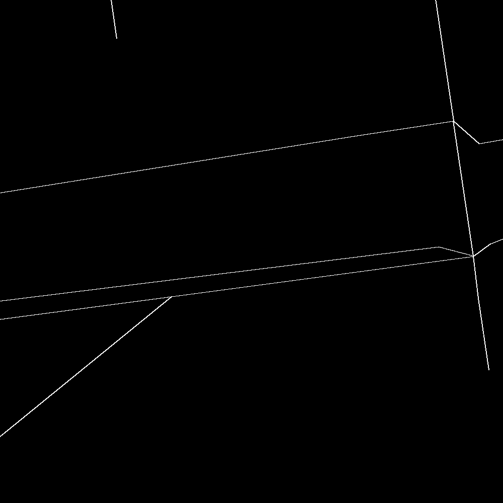
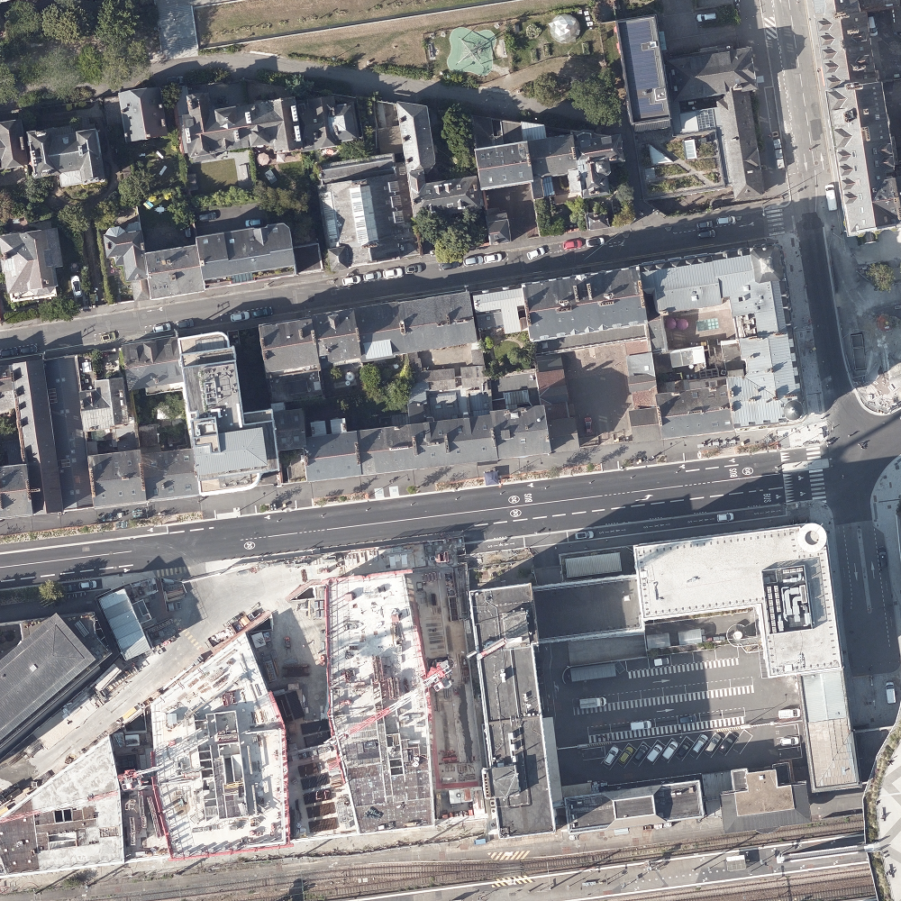
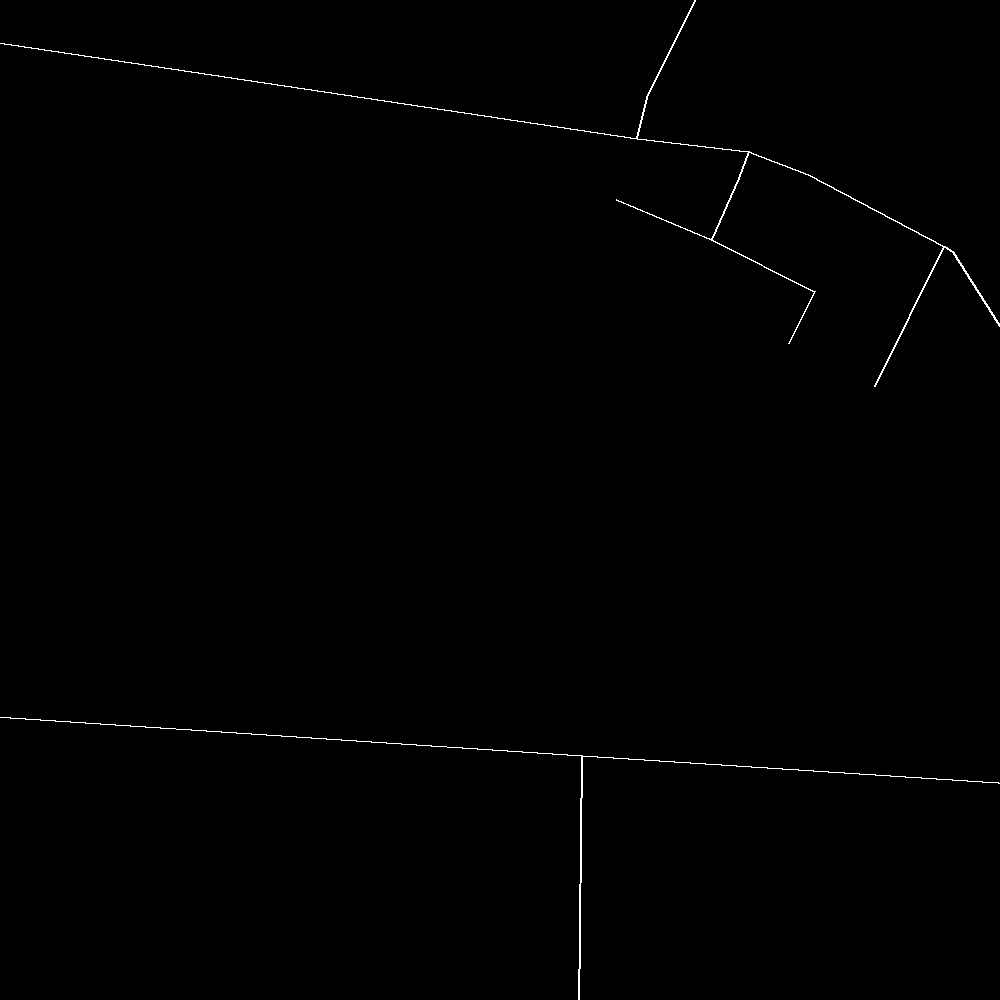
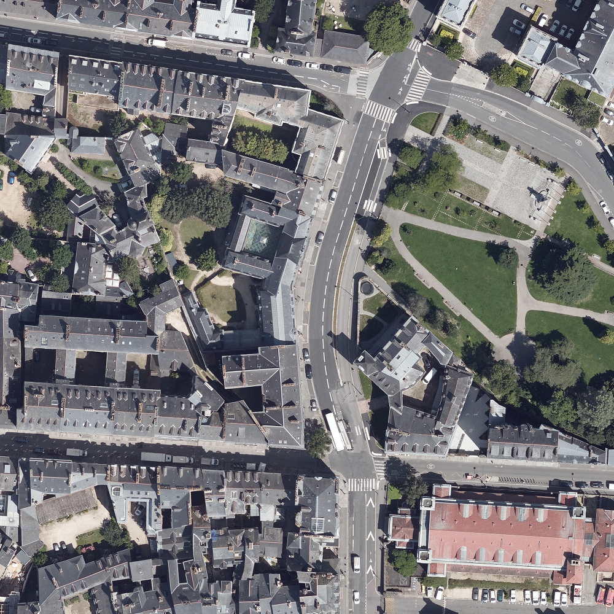

Ensemble d'images de l'**hyper-centre** de Rennes

- Taille en **pixels** : `1000 x 1000`
- Taille en **mètres** : `200 x 200`
- Résolution : `1m = 5px`

## Filtrage des voies

Filtrage selon le type `road`

Valeurs uniques pour 'type' : 
```{'Piste cyclable', 'Lotissement', 'Aire de loisirs', 'Rue', 'Galeries', "Chemin d'exploitation", 'Cité', 'Hameau', 'Route départementale', 'Rocquet', 'Avenue', 'Venelle', 'Chemin rural', 'Voie communale', 'Cour', 'Placette', "Zone d'activités", 'Rocade', 'Ruelle', 'Parc', 'Villa', 'Impasse', 'Campus', 'Contour', 'Parking', 'Espace', 'Terrasses', 'Carrefour', 'Passage', 'Square', 'Quai', 'Village', 'Cours', 'Rabine', 'Plages', 'Jeux', 'Jardins', 'Ruette', 'Route', 'Pré', 'Porte', 'Chemin de halage', 'Jardins familiaux', 'Forum', 'Place', 'Inconnu', 'Placis', 'Plaine', 'Porche', 'Autoroute', 'Parvis', 'Rotte', 'Rond-point', 'Voie verte', 'Lieu-dit', 'Courtil', 'Echangeur', 'Promenade', 'Boulevard', 'Domaine', 'Jardin', 'Résidence', 'Chemin', 'Route nationale', 'Sentier', 'Sillon', 'Prairie', 'Aire', 'Esplanade', 'Pont', 'Carré', 'Mail', 'Allée', 'Etang', 'Talweg', 'Canal', 'Passerelle', 'Clos', 'Terrasse', 'Anneau', 'Bosquets', 'Barreau', 'Vallon', 'Ruelles'}```

Les types suivants sont conservés :

```
road_types = {
    'Route', 'Route départementale', 'Route nationale', 'Autoroute',
    'Boulevard', 'Rocade', 'Voie communale', 'Rue', 'Avenue', 'Echangeur', 
    'Chemin rural', 'Ruelle', 'Impasse', 'Rond-point', 'Ruelles', 'Quai',
    'Carrefour', 'Place', 'Allée', 'Pont', 'Inconnu'
}
```






