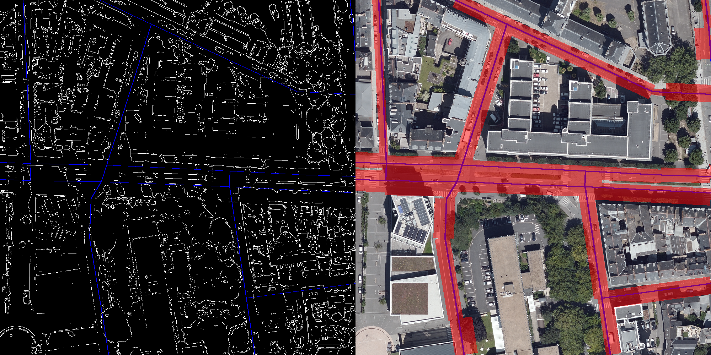
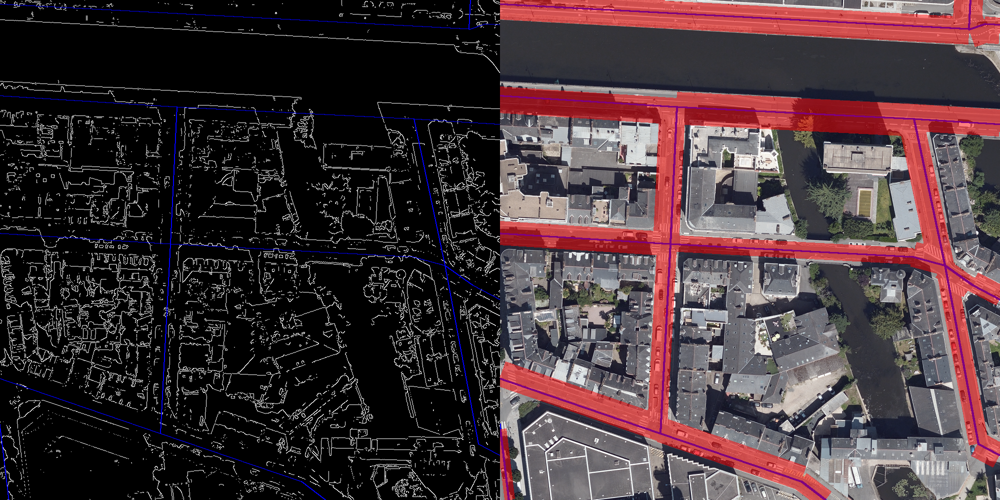
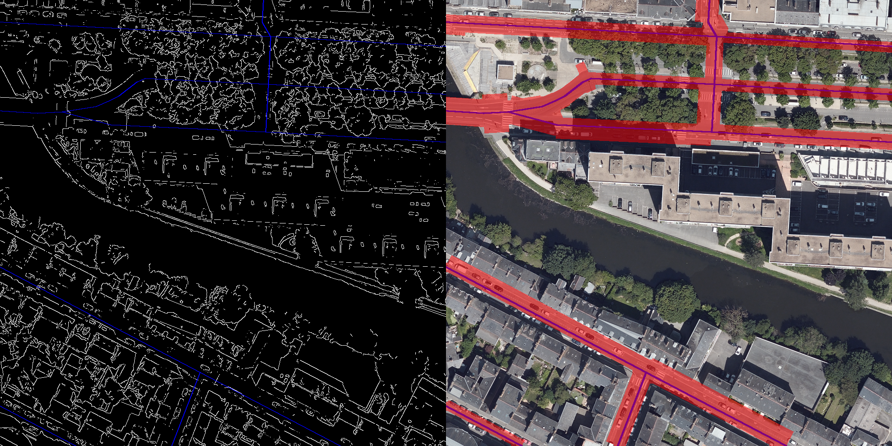
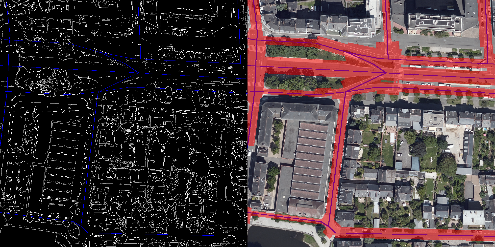
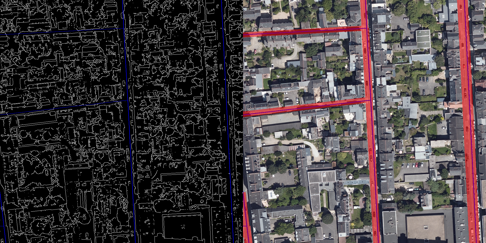

# Algorithme d'estimation des largeurs de routes

Programme principal : `main.py`

A lancer avec : `python .\Methodes_Algorithmiques\perpendicularMethod\main.py -dir=".\ImagesRennes\"`

Fichier `utils.py` : contient des fonction utilitaires

Fichier `draw_normals.py` : permet de visualiser les normales de chaque segment

## Explication du fonctionnement de la méthode

1. **Preprocessing :**

- Application d'un filtre gaussien bilatéral sur l'orthophotographie pour éliminer le bruit et fondre les pixels entre eux, tout en conservant des contours nets

2. **Calcul des contours via filtre de Canny**

- Filtrage des pixels proches du blanc (pouvant correspondre a des passages piétons, pistes cyclables, marquages au sol, etc.) extraits **dans l'orthophotographie** et filtrés **dans l'image de contours**

3. **Calcul des largeurs de chaque segments de l'axe central**
- Extraction des segments de l'axe central grâce au nom du fichier contenant les coordonnées de l'image (voir [Rennes Open Data](https://data.rennesmetropole.fr/explore/dataset/orthophotographie-2021/map/?location=9,48.36172,-1.71387&basemap=0a029a)) et du fichier `'Methodes_Algorithmiques/perpendicularMethod/Data/filaires-projection.json'`
    - voir le fichier `Projet-Indus/ExtractionOrthophotographies/Gdal/projecteur_filaires.py` pour comprendre la création du JSON

- Pour chaque segments dans l'image :
    - Calcul de la normale au segment (rotation de 90°)
    - Récuperation de tous les points du segment
    - Pour chaque point du segment :
        - Parcours des pixels dans la direction de la normale et dans la direction opposée jusqu'à ce qu'un contour soit rencontré
        - On stock donc 2 largeurs pour chaque point du segment
    - Calcul des moyennes des 2 largeurs sur tous les points de l'axe central
    - Conversion pixels vers mètres et sauvegarde dans un fichier JSON
    - Création de l'image de segmentation, à des fin de visualisation

4. **Sauvegarde des images et du fichier JSON contenant les largeurs en mètres**

## Résultats

### Métriques

- Average **Precision** : `89%`
- Average **Recall** : `75%`
- Average **F1 Score** : `81%`

### Image de normales

### Images de segmentation

                    