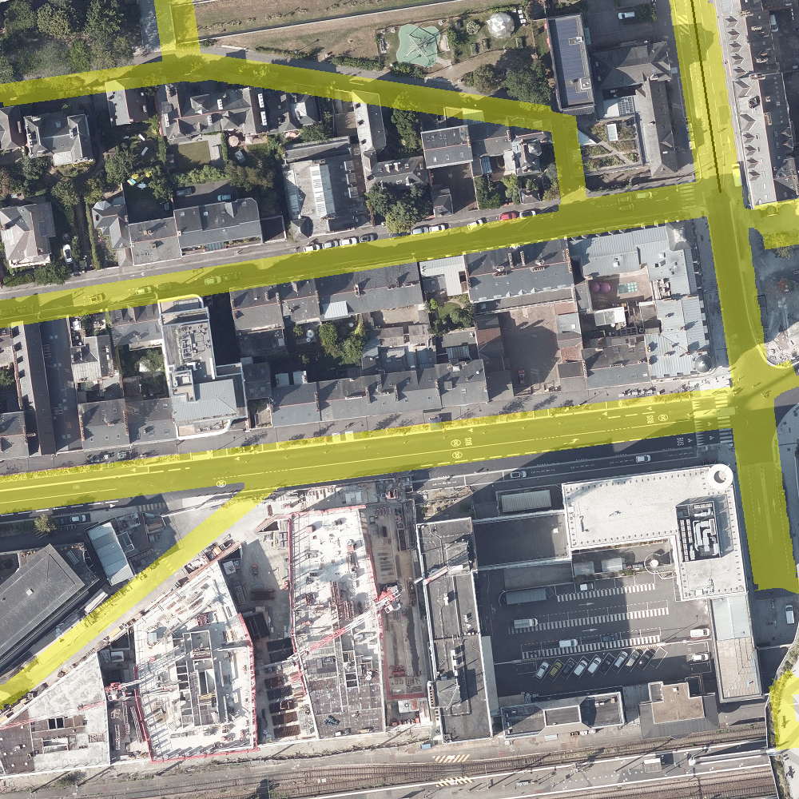

# segmentation_moyennessegment.py

```
python3 .\Methodes_Algorithmiques/perpendicular_Method_realOrtho\segmentation_moyennesegment.py -dir="Methodes_Algorithmiques/perpendicular_Method_realOrtho/images_to_segment"
```

## Détails de la méthode

### **Preprocessing :**
- Suppression des pixels proches du blanc (pouvant correspondre a des passages piétons, pistes cyclables, marquages au sol, etc.) afin d'éviter de faciliter la detection des contours de route sur l'**image de route**
- Application d'un filtre gaussien (5 x 5) sur l'**image de route** pour éliminer le bruit et fondre les pixels entre eux

### **Calcul de la segmentation en parcourant les différentes routes de l'orthophotographie**
Ce processus est appliqué à chaque morceaux de route de l'image obtenue par une database au format json
1. **Calcul des normales à partir de l'axe central :**

- **Skeletonization** de l'image du morceaux d'axe central et calcul de la normal en chaque point via filtres de Sobel 5x5
- **Postprocess** des normales (correction des directions + remplacement des outliers)


2. **Calcul des longueurs en chaque point de l'axe central skeletonizé :**
- Calcul des contours de l'image de route preprocess, via filtre de Canny
- Les pixels sont parcourus dans la direction des **2 normales** (dans la direction de la normale + dans la direction opposée à la normale) et marqués comme étant de la route jusqu-à ce qu'un contour soit rencontré

4. **Moyennage de toutes les largeurs**
- Une fois les longueurs en chaque point calculées, un moyennage est effectuée sur tous les points, car nous supposons qu'une route est de largeur constante (et nous étudiant une portion de route)
- Les outliers sont supprimés dans le calcul de la moyenne via un zscore (z<0.5)

5. **Dessiner la portion de segmentation dans le mask**
- On ajoute au mask de l'image la segmentation obtenue par l'étude de la route


### **Post process de la segmentation :**
- Fermeture 3x3

## Métriques

aucune pour le moment !

## Segmentations :





