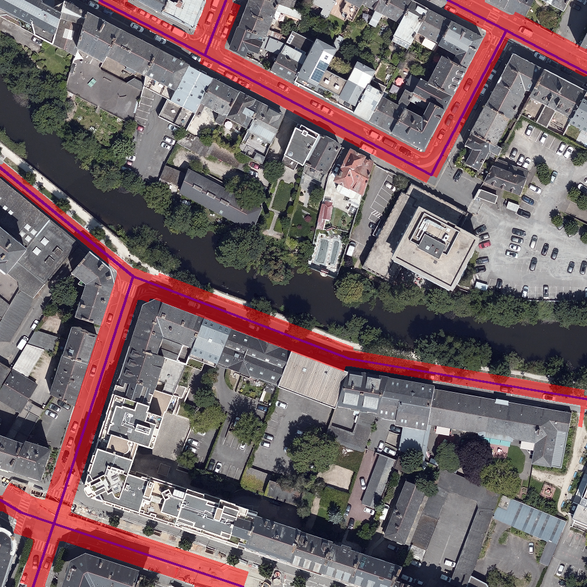

# Projet Industriel

## Objectifs

Faire un état de l’art des méthodes pouvant permettre d’estimer la largeur des routes et trottoirs à partir de vues aériennes dans la perspective :

- D’identifier les zones problématiques pour la circulation (piétons, cyclistes, automobilistes).
- D’aider les municipalités à optimiser l’espace public.

## Travail réalisé

1. Extraction automatisé d’images aériennes de Rennes et des axes centraux correspondants.
2. Segmentation des images : deux méthodes développées (algorithmique et IA).
3. Estimation de la largeur de chaque route en mètres à partir de la segmentation.

### Méthode algorithmique

- Calcul d'une normale associée à chaque segment de route.
- Extraction de contours dans l’image via un filtre de Canny.
- Estimation de la largeur moyenne en suivant la normale en chaque point du segment, jusqu'à atteindre un contour.

#### Avantages

Largeurs uniformes. Toutes les routes sont segmentés.

#### Inconvénients

Non-robuste au bruit (marquage au sol, végétation, ombres, etc.).

### Méthodes par IA

Test de plusieurs modèles de segmentation sémantique :
- Unet [1] : Nombreuses routes non segmentées, largeurs de routes non uniformes.
- DeepLabv3 [2] : Largeurs plus uniformes, mais masque de sortie 64x64 insuffisant pour une segmentation précise.

[1] Ronneberger, Olaf, et al. "U-Net: Convolutional networks for biomedical image segmentation." (2015)

[2] Chen, Liang-Chieh, et al. “Rethinking atrous convolution for semantic image segmentation.” (2017)

#### Avantage

Plus robuste au bruit que la méthode algorithmique.

#### Inconvénients

Beaucoup de routes non segmentées.

## Résultats : segmentations

### Métriques

|             | Algo  | Unet | DeepLabV3 |
|-------------|-------|------|-----------|
| Précision   | 89%   |  ?   |    ?      |
| Rappel      | 75%   |  ?   |    ?      |
| F1 score    | 81%   |  ?   |    ?      |

### Image

#### Méthode algorithmique



#### Unet

???

#### DeepLabV3

???

## Conclusion

**Méthode algorithmique :**
- Donne de bons résultats pour la segmentation des routes.
- Plus efficace que les approches basées sur l'IA.

**Trottoirs :**
- Très peu contrastés par rapport à la route dans les images aériennes.
- Difficile à segmenter et à estimer leur largeur de manière indépendante.

**Perspectives :**
- Test des méthodes sur d’autres villes que Rennes.

## Arborescence des fichiers
```
├─ ExtractionOrthophotographies,
│  ├─ Gdal,
│  └─ mask_creator
│
├─ ImagesRennes
│  
├─ Methodes_Algorithmiques
│  ├─ metricsComputing
│  │  └─ toComputeMetrics
│  │     ├─ mask
│  │     └─ truth
│  │
│  ├─ perpendicularMethod,
│  │  ├─ Data
│  │  └─ results
│
└─ Methodes_IA,
   └─ Deeplabv3+_RoadSegmentation,
```