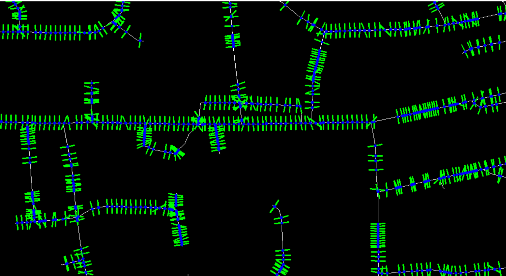
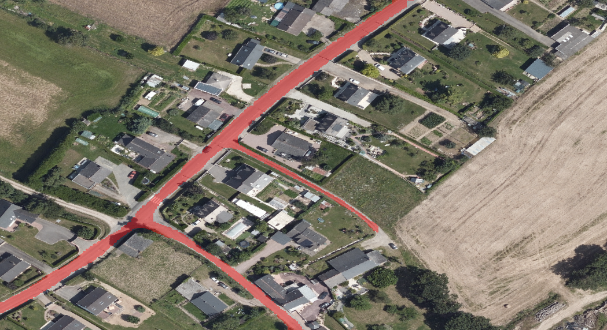

# segmentation_average.py

```
python3 .\perpendicular_Method\segmentation_average.py -img= -min= -max=
```

- Preprocessing des images (filtre bilatéral sur la route + skeletonization de l'axe central)
- Calcul du gradient de l'axe central skeletonizé afin obtenir les normales en chaque point

- Création du masque de segmentation :
    - on applique un filtre de Canny sur l'image de route pour obtenir les contours
    - pour chaque point de l'axe central, on parcous les pixels dans la direction de la normale et on marque les pixels comme faisant partie du masque jusqu'à ce qu'on atteigne un pixel de contour

## Résultat :

